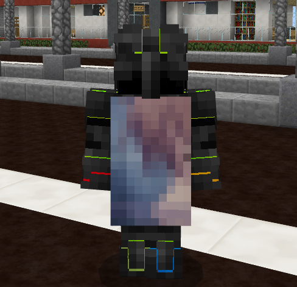

# SimpleCape
Cape Plugin for PMMP

### How To Use
1. enable gd lib
2. add cape file (png) to directory plugin/SimpleCape

## Commands
1. command for player /cape [name of cape]
2. use command for admin /cape [name of cape] [target user]

### Permissions
1. simple.cape = set cape for your self
2. simple.cape.other = set cape for another player
3. simple.cape.name.(NameOfCape) = permission player per cape [Example: simple.cape.name.diamond]

### QnA
Q: How to enable GD?\
A: Read this [Windows](https://forums.pmmp.io/threads/gd-on-php.6532/) or [Linux](https://forums.pmmp.io/threads/how-to-install-gd-lib-in-php-binary.4372/)
